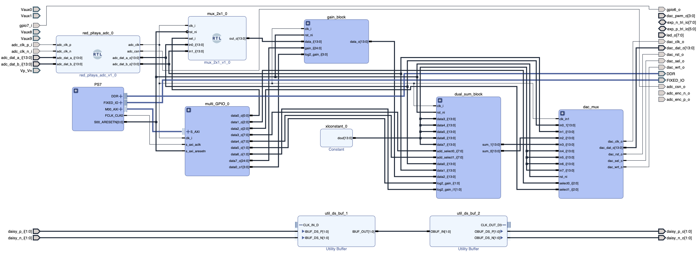

# Example project
### Example Red Pitaya bitfile and interface

This example project defines a simple bitfile, and a corresponding Python interface. Use this as a starting point to define your own project. Here's a figure showing the block diagram in Vivado:



The interface to this bitfile is defined in `example_controller.py`.

The FPGA code for this project is located in the `fpga/redpitaya_example_project` directory of this repository. Build the project in Vivado by navigating to this folder, and running the command `source ./create_project.tcl`. Depending on your version of Vivado, there will be errors when executing this step preventing the project from being built. If that happens, refer to the section [Dealing with Vivado's Errors](#dealing-with-vivados-errors) below.


## Usage:

### Example using the GUI
```python3
from rp_interface.top_level_modules import ExampleController

example = ExampleController(
    'red-pitaya-00.ee.ethz.ch',
    load_bitfile=True,
    apply_defaults=True,
    make_gui=True
)

example.show_gui()
```

### Example using the API
```python3
from rp_interface.top_level_modules import ExampleController

example = ExampleController(
    'red-pitaya-00.ee.ethz.ch',
    load_bitfile=True,
    apply_defaults=True,
    make_gui=False
)

# Objective: 
# Set output0 to: In0 - 0.1*In1:
# Set output1 to: In1 

# Adjust gain block
print(example.input_select_names)  # Check which input carries which signal
example.input_select = 1  # Select In1
example.gain = -0.1  # Multiply In1 by -0.1

# Adjust sum0 block
print(example.sum0.input_names)  # Show which input carries which signal
example.sum0.add0 = True  # Add In0
example.sum0.add1 = False  # Don't add In1
example.sum0.add2 = True  # Add Gain block
example.sum0.divide_by = 1  # Don't divide output

# Select outputs
print(example.output_select_names)
example.output0_select = 2  # Set to Sum0
example.output1_select = 1  # Set to In1
```

### Code snippet to define new `defaults` and `gui_config` files

```python3
from rp_interface.top_level_modules import ExampleController

# Generate an instance of your class, without applying defaults or making gui
example = ExampleController(
    'red-pitaya-00.ee.ethz.ch',
    load_bitfile=True,
    apply_defaults=False,
    make_gui=False
)

# Define a new defaults file
example.save_settings('./my_new_default_settings.yaml')
# Then:
# - open and edit this file to match your desired settings
# - move it to the config directory
# - rename it to match example_controller.defaults_file

# Define a new gui_config file
from rp_interface.gui_utils import generate_rp_module_gui_config_file
generate_rp_module_gui_config_file('./my_new_gui_config.yaml', 'Example Red Pitaya', example)
# Then:
# - open and edit this file to match your desired settings. There are usually quite a few things to change
#     (e.g. change the parameter type for multiplexers, rename inputs for sum modules, ...).
#     Look at other gui_config files for examples 
# - move it to the config directory
# - rename it to match example_controller.gui_config_file
```


## Dealing with Vivado's Errors

If some cases, running `source ./create_project.tcl` will fail, but not output any error message (it simply won't generate a working block design). This happens when there is an error running the `block_design.tcl` script. When this is the case, try running `source block_desgin.tcl`. This should produce an explicit error message

### Common errors
#### Script was generated with a different version of Vivado
If the `block_design.tcl` script was generated with a different version of Vivado than you are currently using, it will throw an error. The script explicitly checks the version number of Vivado, and throws an error if it doesn't match the expected version. In practice, there is no real compatibility issue, so simply delete the offending lines and run the script again.

```tcl
################################################################
# Check if script is running in correct Vivado version.
################################################################
set scripts_vivado_version 2021.1
set current_vivado_version [version -short]

if { [string first $scripts_vivado_version $current_vivado_version] == -1 } {
   puts ""
   catch {common::send_gid_msg -ssname BD::TCL -id 2041 -severity "ERROR" "This script was generated using Vivado <$scripts_vivado_version> and is being run in <$current_vivado_version> of Vivado. Please run the script in Vivado <$scripts_vivado_version> then open the design in Vivado <$current_vivado_version>. Upgrade the design by running \"Tools => Report => Report IP Status...\", then run write_bd_tcl to create an updated script."}

   return 1
}
```

#### An IP block has an incorrect version number
Vivado also checks that every IP block in the design uses the same version number as before. This can be problematic if a newer version of Vivado has updated IP blocks, since older versions will no longer be available. If this happens, figure out which IP block is missing based on the error message, and remove the version number specification in the `block_design.tcl` script. E.g. if the error message complains about a missing `clk_wiz` module, find  and fix the line(s) defining `clk_wiz` as follows:

```tcl
set clk_wiz_0 [ create_bd_cell -type ip -vlnv xilinx.com:ip:clk_wiz:6.0 clk_wiz_0 ]
``` 

```tcl
set clk_wiz_0 [ create_bd_cell -type ip -vlnv xilinx.com:ip:clk_wiz clk_wiz_0 ]
``` 

#### A module is missing
The `block_design.tcl` relies on external sources (generally IP blocks or verilog/vhdl files) and will fail if those are not yet loaded. If a required module has not been loaded before making the block design, it will fail. This usually happens when a verilog file is saved to the wrong location (they should be saved in the `verilog` directory)