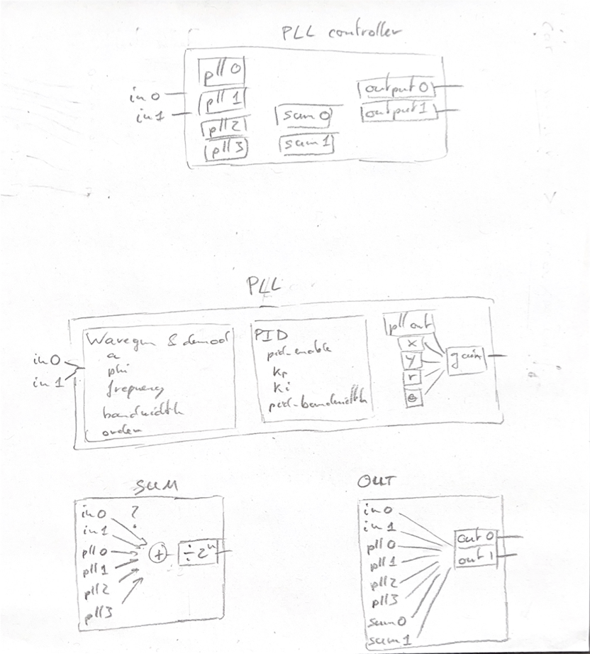

# Red Pitaya based PLL controller

## Basic description
This red pitaya interface contains four PLL modules that can be used to generate a parametric feedback cooling signal.

Defines the following:
- four `pll_modules` modules: these are the PLL modules that phase lock to an input signal
- two `sum` modules: these modules take the output of the pll modules as inputs and can selectively add them.

Below is a super simplified block diagram:




## Detailed description
Here's the detailed list of what the `PLLController` class describes.

- `PLLController`
  - `output0_select`: `int` selecting the output for PLL controller
  - `output1_select`: `int` selecting the output for PLL controller
  - `output_select_names`: `dict` describing the options for `output0_select` and `output1_select`
  - `constant0`: `float`, constant value in range -1 to 1 (connected to input of sum module)
  - `constant1`: `float`, constant value in range -1 to 1 (connected to input of sum module)
  - `sum0`: `SumModule` instance
  - `sum1`: `SumModule` instance
  - `pll0`: `PLLModule` instance
  - `pll1`: `PLLModule` instance
  - `pll2`: `PLLModule` instance
  - `pll3`: `PLLModule` instance


- `PLLModule`
  - `input_select`: `int` selecting the input of the PLL module 
  - `input_select_names`: `dict` describing the options for `input_select`
  - `second_harmonic`: `bool` describing whether the output frequency should be doubled or not
  - `frequency`: `float`, the frequency of the reference signal in Hz
  - `a`: `float`, the amplitude of the output signal (in range -1 to 1)
  - `phi`: `float`, the phase of the output signal (in degrees, in range -180 to 180)
  - `demodulator_bandwidth`: `float`, bandwidth of demodulator (in range 0 to 120kHz)
  - `order`: `int`, order of demodulator filter
  - `pid_enable`: `bool`, whether the pid loop is enabled or not
  - `kp`: `float`, PID proportional constant
  - `ki`: `float`, PID integral constant
  - `pid_bandwidth`: `float`, bandwidth of the PID loop in Hz
  - `gain`: `float`, gain of PLL output signal
  - `output_select`: `int` for selecting the output of the PLL module
  - `output_select_names` : `dict` describing the options for `output_select`
  - `constant`: `float`, value of constant output (in range -1 to 1)


- `SumModule`
  - `add0`: `bool` describes whether input0 is added or ignored
  - `add1`
  - `add2`
  - `add3`
  - `add4`
  - `add5`
  - `add6`
  - `add7`
  - `sum_input_names`: `dict` describing the input signals
  - `divide_by`: `int`, must be a power of 2. The output will be divided by this value. This is useful to avoid saturating an output when adding multiple signals.

### Usage example

```python3
from rp_interface.top_level_modules import PLLController

pc = PLLController(
    red_pitaya='red-pitaya-01.ee.ethz.ch',
    load_bitfile=True,
    apply_defaults=True
)

# set up pll0
pc.pll0.input_select = 0
pc.pll0.frequency = 65e3
pc.pll0.pid_enable = True
pc.pll0.gain = 1.8
print(pc.pll0)  # View pll settings

# Copy settings of pll0 to pll1
pc.pll1.copy_settings(pc.pll0)

# set up pll1
pc.input_select = 1
pc.frequency = 72e3
pc.pll1.pid_enable = True

# set up sum module to add plls 0 and 1
pc.sum0.add0 = False
pc.sum0.add1 = False
pc.sum0.add2 = True
pc.sum0.add3 = True
pc.sum0.add4 = False
pc.sum0.add5 = False
pc.sum0.divide_by = 2.  # Downscale output (to avoid saturation)
print(pc.sum0)  # Verify sum0 settings

# set output 0
print(pc.output_select_names)  # View the possible output options
pc.output0_select = 6  # output from Sum0 module
```