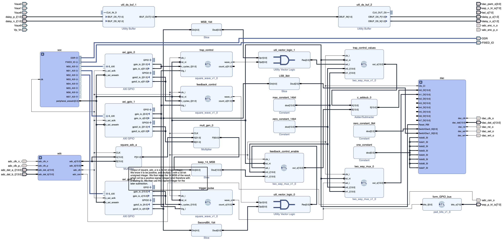

## Red Pitaya based AOM Controller

Combines On/Off control and parametric feedback cooling control for an AOM.

### Basic description:
Generates two square wave pulses with different duty cycles. The first wave is a 1V signal sent directly to the output, to control whether the trap is on or off. The second wave controls whether a feedback signal is subtracted from the output or not. There's also a master disable switch for the feedback. The combined signal is sent to `DAC 1`.

At the same time as the signals are toggled, a trigger pulse is generated and set to GPIO pin `DIO0_P`.

The signal on `DAC 2` can either be set to replicate `DAC 1` or the GPIO trigger pulse.

See below for a basic functional diagram and the more detailed block diagram from vivado.

### Python interface
The class for controlling this red pitaya bitfile is called `RedPitayaAOM`. The relevant methods and properties are:
- `trap_toggle_time`: Time that trap should be off in seconds, in seconds (default `1e-6`)
- `feedback_toggle_time`: Time that feedback should be off, in seconds (default `1e-3`)
- `feedback_amplitude`: Gain factor for feedback signal (default `0.05`)
- `trigger_pulse_time`: Pulse width for trigger (default `500e-9`)
- `trap_enable`: default `0`
- `feedback_enable`: default `0`
- `output_select`:  default `0`
- `trigger_now()`: Launches a trigger pulse when called

### Implementation details

#### Launch pulses
All three pulses (trap toggle, feedback toggle and trigger pulse) are started simultaneously, on the rising edges of trigger register on `AXI_GPIO_1`.

#### Feedback signal
The feedback signal is generated by squaring input A, multiplying it by a 32-bit integer, then keeping only 14 most significant bits. The resulting signal is frequency doubled, and it's amplitude is at most half of the initial amplitude.

Ideally, the FB signal should use as much dynamic range as possible without clipping, and the feedback gain adjusted accordingly.

There's also a master disable switch for the feedback, which is set by toggling a control bit.

#### Trap and feedback toggle times
The switching duration of the trap is given in terms of `adc_clock` cycles, which are 32ns long (125MHz clock freq divided by 4)

#### Trigger pulse width
The same applies to the width of the trigger pulse

#### Diagrams

#### Addresses
- `0x41200000`: 32-bit value, n_cycles trap
- `0x41200008`: 32-bit value, n_cycles feedback
- `0x41210000`: 1-bit value, trigger. detects rising edge
- `0x41210008`: 32-bit value, squarer gain
- `0x41220000`: 16-bit value, n_cycles trigger
- `0x41220008`: 4-bit value, MSB is a disable pin for FB control, 3LSBs output select for DAC2 (0-7, 0 for DAC 1, 1 for trigger)